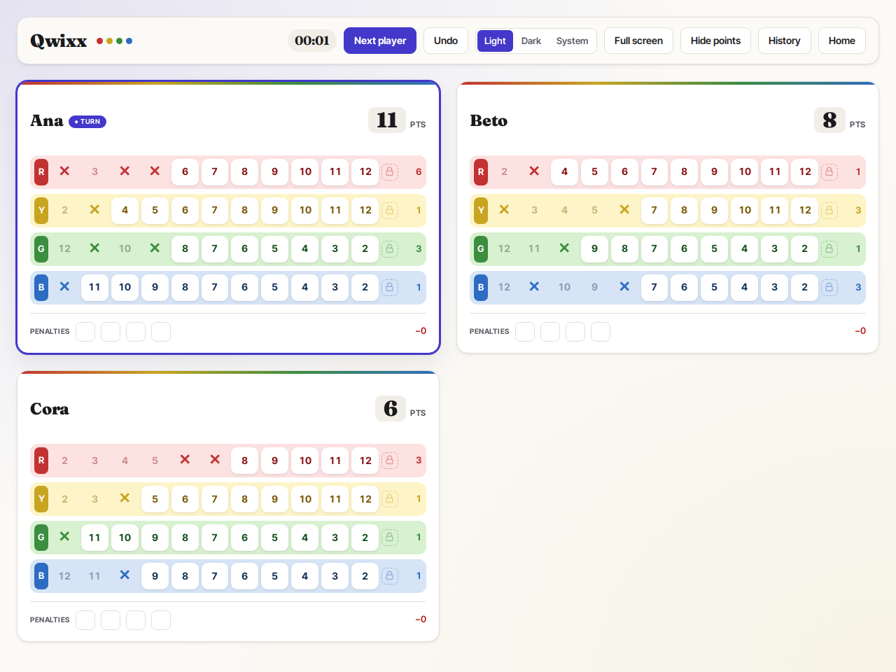

# Qwixx Scoreboard

[](https://github.com/tiagomorato/qwixx/actions/workflows/ci.yml)


[](LICENSE)

A digital scoreboard for the dice game Qwixx. Roll real dice at the table, and track every player's sheet on a phone, tablet or laptop instead of paper. Several devices stay in sync live, so each player can follow along on their own screen.



## Features

- 2 to 6 players, with the official scoring table, row locks and penalties
- Illegal moves are blocked, such as crossing out a number left of an existing cross or locking a row with fewer than five crosses
- Detects the end of the game (two rows closed, or four penalties) and offers to finish it
- Undo for any action, with a notice on every device naming what was undone
- **Live sync across devices** over Server-Sent Events, with no reload needed
- Turn tracking, per-row scores, a hide-points mode, light/dark/system theme and haptic feedback on phones
- Game history with final scoreboards, plus share and rematch from the final screen

## Architecture

```
shared/   Pure TypeScript game rules: scoring, legality, actions, undo
server/   Bun HTTP server: REST API, SSE hub, JSON storage with atomic writes
client/   React 18 + Zustand + Vite
```

The rules live in `shared/` without any I/O and are shared by both sides. The server checks the shape of every state it receives against the shared constants, and uses the shared rules to decide whether a game may be finalized. The client saves with a 250 ms debounce. The server writes atomically behind a mutex and broadcasts each new state over SSE to every connected device.

## Quality

Built spec-first with [GitHub Spec Kit](https://github.com/github/spec-kit) and Claude Code. Each feature started as a written specification with user stories and Given/When/Then acceptance scenarios ([`specs/`](specs/)), under a project [constitution](.specify/memory/constitution.md) that makes code quality and testing non-negotiable.

| Layer | Tooling | Scope |
|---|---|---|
| Unit | `bun test` | 78 tests for the game rules, API routes, storage and the SSE hub |
| Performance | `bun test` | Budget tests for rule evaluation, layout recomputation and API round-trips |
| End-to-end | Playwright + axe-core | 18 tests in 11 specs, one per user story, each against its own isolated server and data directory, with accessibility and colour-contrast audits in both themes |
| Static | Biome, `tsc` (strict) | Lint, format and type checks |

All four layers run in [GitHub Actions](.github/workflows/ci.yml) on every push. Biome and the type check also run as a pre-commit hook via lefthook.

## Running it

Requires [Bun](https://bun.sh) 1.3+.

```bash
bun install
bun run dev:server   # API on :8787
bun run dev:client   # app on :5173, reachable from phones on the same network
```

Or run everything on one port with Docker:

```bash
docker compose up -d   # http://localhost:8787, games stored in ./data
```

Tests:

```bash
bun run check && bun run typecheck
bun run test          # unit
bun run test:perf     # performance budgets
bun run test:e2e      # Playwright (bunx playwright install chromium first)
```

## Disclaimer

A fan-made scoreboard for personal use. Not affiliated with or endorsed by the publisher of Qwixx. You still need the game's dice.

## License

[MIT](LICENSE)
